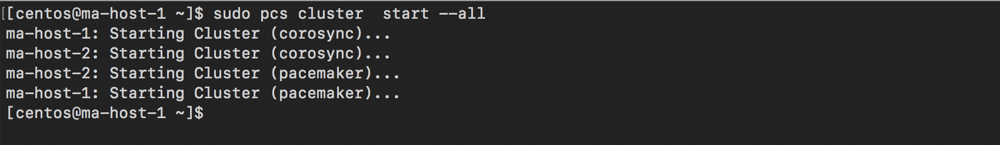

# Access your Multi-Attach EBS volumes across multiple hosts using GFS2
***
One of the design patterns for high availability of mission critical applications is the use of shared storage. This architectural pattern allows the storage volumes to be accessed on multiple hosts at the same time, making the application resilient to node failures. [Amazon Elastic Block Store(EBS)](https://aws.amazon.com/ebs/) volumes can be attached to multiple [Amazon Elastic Compute Cloud (EC2)](https://aws.amazon.com/ec2/) instances using the [Amazon EBS Multi-Attach](https://docs.aws.amazon.com/AWSEC2/latest/UserGuide/ebs-volumes-multi.html) feature. This feature can be used for high availability by using a cluster-aware file system such as GFS2 that safely coordinates storage access between instances to prevent data inconsistencies.   
This blog post walks you through the process of setting up GFS2 using Multi-Attach enabled EBS volumes attached to two EC2 instances which are a part of a Linux cluster.

###  High Level Steps:
1. Setting up EC2 instances and Multi-Attach enabled EBS volumes.
2.	Installing the cluster software.
3.	Configuring the cluster.
4.	Setting up GFS2.

### Setting up EC2 instances and Multi-Attach enabled EBS volumes volumes:
For this post the CentOS 7 AMI available on the AWS marketplace and has been used. The setup will include:
1.	Two EC2 instances (ma-host-1 and ma-host-2) running a Linux cluster.  
2.	Multi-Attach enabled EBS Volume – Shared-vol
3.	GFS2 filesystem mounted as /sharedFS on both nodes. 


*<sub>Figure 1: Layout for the use case</sub>*

Create the Multi-Attach enabled EBS volume- Navigate to the Create Volume menu in the EBS section of the EC2 console and [create](https://docs.aws.amazon.com/AWSEC2/latest/UserGuide/ebs-volumes-multi.html#enable) a Multi-Attach enabled EBS volume.


*<sub>Figure 2: Creating Multi-Attach Enabled EBS volume</sub>*

Once the volume has been created successfully, you need to attach it to both the Amazon EC2 instances. This can be done by selecting “Attach Volume” from the Actions button menu in the AWS console.


*<sub>Figure 3: Attaching the EBS volume </sub>*

Select the hosts that you wish to attach the volume to. In this case it is ma-host-1 and ma-host-2.

  
*<sub>Figure 4: Selecting the Hosts </sub>*

Once you have attached the EBS volume to both the nodes, run the ‘lsblk’ command to confirm that the EBS volume is now visible on both the hosts:


*<sub>Figure 5: lsblk output from the hosts </sub>*


Now that we have the volume attached to both the EC2 instances, we can start the cluster setup.

### Installing the cluster software:

Before setting up the cluster software, run “yum update” on both the nodes.  Also, ensure that the nodes are able to reach each other over the network and can resolve each other’s hostname.


*<sub>Figure 6: /etc/hosts files and hostnames </sub>*

Install cluster software using the yum command on both nodes:
```bash
sudo yum install pacemaker pcs -y
```
You will be using pcs to configure your cluster.  To start and enable the pcsd daemon run the following on both nodes:
```bash
sudo systemctl start pcsd.service
sudo systemctl enable pcsd.service
```

The cluster software creates a user hacluster which will be used to configure the cluster. The hacluster user will be used by the cluster to perform cluster tasks like syncing the configuration and starting and stopping services on cluster nodes. To get started, the password for hacluster needs to be set on both the nodes and has to be same. To set the password for the hacluster user run the following commands on both the nodes:
```bash
sudo passwd hacluster
```
### Configuring the cluster:

With the required software installed, you can proceed to configuring the cluster. 
Use pcs cluster command on any node to authenticate using the hacluster user: (Enter username as hacluster and when prompted, enter the password from the previous step)

```bash
sudo pcs cluster auth ma-host-1 ma-host-2  
```
If your cluster nodes are able to communicate with each other using their registered hostnames you should see an output like the one below:


*<sub>Figure 7: Authenticating haclusteruser for both nodes </sub>*

If the command fails to complete, please see if the instances are able to resolve each other’s hostname properly and also if the security group configuration [allows traffic between instances belonging to the same security group](https://docs.aws.amazon.com/AWSEC2/latest/UserGuide/security-group-rules-reference.html#sg-rules-other-instances).  
Next, configure a name for the cluster and add the two nodes as its members using the command below(run on any one node)

```bash
sudo pcs cluster setup --name macluster ma-host-1 ma-host-2
```

If the command is successful then you should see an output like this:

*<sub>Figure 8: Configuring the cluster name and membership </sub>*

Once the cluster has been setup successfully, you can start the cluster using the pcs cluster start command:

```bash
sudo pcs cluster start --all
```

*<sub>Figure 9: Starting the cluster </sub>*


The status of the cluster can be checked using the following commands:
```bash
sudo pcs status corosync  
sudo pcs status
```


*<sub>Figure 10: Displaying Cluster status </sub>*

Setting up fencing: The next step is to set up a fencing device for the cluster. Fencing is an important component of the cluster configuration which is used to prevent IO from nodes which are non-responsive on the network but still have access to the shared EBS volume. You will use the aws_fence agent to setup fencing for our cluster.

Install the fence agent on the nodes on both the nodes:

```bash
sudo yum install fence-agents-aws.x86_64 -y
```

Once the agent is successfully installed, it should be visible in the output of the following command:

```bash
sudo pcs stonith list
```


*<sub>Figure 11: Displaying aws fence device </sub>*

The fence_aws agent needs the credentials of an IAM user with privileges to describe, start, reboot and stop the two EC2 instances. If you don’t have one already, [create an IAM user](https://docs.aws.amazon.com/IAM/latest/UserGuide/id_users_create.html) with the required privileges. You will need the user credentials(Access Key and Secret Key) in the next step. 

To configure the fencing agent, use the “pcs stonith create” command on one of the hosts:
```bash
sudo pcs stonith create clusterfence fence_aws \
access_key="your access key" \
secret_key="your secret key" \
region=us-west-2 \
pcmk_host_map="ma-host-1:Instance-ID-1;ma-host2:Instance-ID-2" \
power_timeout=240 pcmk_reboot_timeout=480 pcmk_reboot_retries=4 
```


*<sub>Figure 12: Setting up fencing </sub>*

### Setting up GFS2: 
After completing the cluster configuration, you need to setup GFS2. To begin, you need the gfs2-utils package for gfs2 and the utilities required to manage the gfs2 file system. Also since you will be using LVM to create volumes on the disk, you will need the lvm2-cluster package which has the cluster extension for LVM tools.

To install run the following on both the nodes:
```bash
sudo yum install gfs2-utils.x86_64 lvm2-cluster.x86_64 -y
```

Before proceeding with the next step, create the mountpoint /sharedFS on both nodes.
```bash 
sudo mkdir /sharedFS
```

The default cluster behaviour is to stop a node that has lost quorum. However for GFS2 it is a best practice to change it to “freeze” IO  till quorum is retained. To make the change run the following on any of the nodes:

```bash
sudo pcs property set no-quorum-policy=freeze
```


*<sub>Figure 13: Setting the noquorum policy to freeze </sub>*

Setup the dlm(Distributed Lock Manager) resource by running the following on any node:

```bash
sudo pcs resource create dlm ocf:pacemaker:controld op monitor interval=30s on-fail=fence clone interleave=true ordered=true
```


The following command needs to be executed on both the nodes to enable clustered locking:

```bash
sudo /sbin/lvmconf --enable-cluster
```

Clvmd is the clustered LVM daemon which is responsible for distributing LVM metadata updates across the cluster. The following command needs to be executed on any node to create clvmd as a cluster resource:

```bash
sudo pcs resource create clvmd ocf:heartbeat:clvm op monitor interval=30s 
on-fail=fence clone interleave=true ordered=true
```

Also, clvmd needs to start after dlm and the clvmd resource needs to be on the same node as the dlm resource. The following set of commands(run on any node) defines the constraints:

```bash
sudo pcs constraint order start dlm-clone then clvmd-clone
sudo pcs constraint colocation add clvmd-clone with dlm-clone
```

Create the volume group and the logical volume using the following commands on any of the nodes(Replace /dev/nvme1n1 with the device name visible for the Multi-Attach enabled EBS volume in your setup)

```bash
sudo pvcreate /dev/nvme1n1  
sudo vgcreate -Ay -cy clustervg /dev/nvme1n1  
sudo lvcreate -L99G -n clusterlv clustervg
```

Next step is to create the GFS2 filesystem on the volume created above. Run the following command on any of the nodes to create a GFS2 filesystem.

```bash
sudo mkfs.gfs2 -j2 -p lock_dlm -t macluster:sharedFS /dev/clustervg/clusterlv
```
It is important to specify the correct values after the -t switch. The correct format is **cluster_name:FSName** which is **macluster:sharedFS** in our setup. 


*<sub>Figure 14: Configuring GFS2 </sub>*

Some points to note before you proceed to mount the GFS2 filesystem:
1.	The mount entries are not made in the /etc/fstab file as the resource is managed by the cluster. Mount options can be specified while creating the resource.
2.	The ‘noatime’ option is recommended if your workload does not need file access times to be recorded every time a file is accessed on the GFS2 file system. 

Create a filesystem resource by running the following command on any node:

```bash
sudo pcs resource create clusterfs Filesystem device="/dev/clustervg/clusterlv" 
directory="/sharedFS" fstype="gfs2" options="noatime" op monitor interval=10s 
on-fail=fence clone interleave=true
```

Finally, for setting up the GFS2 and clvmd dependency and startup order use the following commands:

```bash
sudo pcs constraint order start clvmd-clone then clusterfs-clone
sudo pcs constraint colocation add clusterfs-clone with clvmd-clone
```

The above commands will mount the newly created GFS2 file system on both nodes.


*<sub>Figure 15: /sharedFS mounted on both nodes </sub>*

**Congratulations!** You have successfully setup a GFS2 filesystem and can use the EBS volume on both the nodes simultaneously.

### Conclusion:  
In this post you learnt how to access Multi-Attach enabled EBS volumes safely across multiple EC2 instances using GFS2. While the post uses a sample configuration to setup a simple Linux cluster with a GFS2 file system, it is important to note that both the cluster and GFS2 will need detailed planning and testing based on several factors unique to every environment. To learn more about Amazon EBS and the Multi-Attach EBS feature, please refer to the Amazon EC2 [documentation](https://docs.aws.amazon.com/AWSEC2/latest/UserGuide/AmazonEBS.html).


